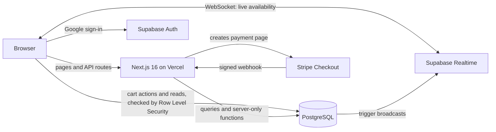

# Tixly

[](https://github.com/nancy-kataria/Tixly/actions/workflows/database-tests.yml)

**Tixly** is an event ticketing app, inspired by Ticketmaster. Fans browse events, add tickets to a cart, pay with Stripe, and resell or transfer their tickets, and they watch availability change live as others shop. Organizers create venues and events split into priced sections, and Tixly creates a ticket for every spot.

It started as a web backend school project with MongoDB and custom JWT auth. It has since been rebuilt on Next.js 16, PostgreSQL (Supabase) and Stripe.

### Built With

[![Next.js][Next.js]][Next.js-url]
[![React][React]][React-url]
[![JavaScript][JavaScript]][JavaScript-url]
[![Tailwind CSS][Tailwind CSS]][Tailwind-url]
[![Supabase][Supabase]][Supabase-url]
[![PostgreSQL][PostgreSQL]][PostgreSQL-url]
[![Stripe][Stripe]][Stripe-url]
[![Vercel][Vercel]][Vercel-url]
[![GitHub Actions][GitHub Actions]][GitHub-Actions-url]

## Features

**For fans**
- Browse upcoming events, and search by name, artist or venue or filter by category
- Sign in with Google
- Add tickets from a section (General, Premium, Front row, …) or from other fans' resale listings to a cart. Tickets are held for 10 minutes, up to 8 per cart.
- See ticket counts change live as other people shop, without reloading
- Pay with Stripe Checkout (test mode, so no real money moves)
- Resell a ticket at your own price, cancel the listing, or transfer it to another user by email
- View your tickets and transaction history

**For organizers**
- Become an organizer from the "For organizers" page or your profile
- Add venues and create events with up to 10 sections, each with its own price and capacity
- See all your events on your profile

**Design:** a responsive "Electric Mint" design system on Tailwind CSS 4, with color tokens and frosted-glass surfaces. Text colors are checked for accessible contrast.

## Architecture



## How it works

- **Concurrency.** Ticket actions run as PostgreSQL functions, each as a single transaction. `hold_tickets` claims tickets with `FOR UPDATE SKIP LOCKED`, so shoppers arriving at the same moment get different tickets instead of waiting on each other. Holds end on their own: a ticket counts as held only while `held_until` is in the future, so no background job is needed.
- **Payments.** Checkout turns the cart into an order, with prices taken from the database rather than the browser, and opens a Stripe payment page. When Stripe confirms payment (by webhook, or when the buyer returns), `complete_order` hands every ticket over in one step. It is safe to run twice for the same payment. If a ticket was taken in the meantime, the whole payment is refunded.
- **Live updates.** When tickets change, a database trigger broadcasts one availability snapshot per event over Supabase Realtime (WebSockets), so every open event page updates at once. Order pages also listen for their payment being confirmed.
- **Security.**
  - Google OAuth (PKCE flow), with sessions verified on the server. `src/proxy.js` keeps sessions fresh and protects signed-in pages.
  - Row Level Security decides what each user can read. For example, you only see your own orders.
  - Column-level privileges stop users from changing their own role.
  - Payment functions can only be called by the server, using the secret key.
- **Data integrity.** Check constraints make invalid tickets impossible. For example, a ticket can't be sold without an owner, listed without a price, or held in a cart after it's sold.
- **Tested with pgTAP.** SQL tests in `supabase/tests` cover carts, checkout, payment, refunds, resale, transfers, organizer rules, access rules and live availability. GitHub Actions runs them on a fresh database for every pull request.

### Database

| Table | Stores |
|---|---|
| `profiles` | One per user, with a role of `user` or `organizer` |
| `venues` | Name, address and capacity |
| `events` | Organizer, venue, category and date |
| `ticket_sections` | An event's sections, each with a price and capacity |
| `tickets` | One per spot, numbered within its section. Status is `available`, `sold` or `listed`, plus who holds it in a cart and until when. |
| `orders` / `order_items` | Checkouts and the tickets in them, linked to a Stripe Checkout Session |
| `ticket_transactions` | History of every purchase, resale and transfer |

**Functions:**
- Cart and checkout: `hold_tickets`, `hold_resale_ticket`, `release_ticket`, `create_order`
- Payment (server only): `complete_order`, `expire_order`
- Tickets: `list_ticket`, `unlist_ticket`, `transfer_ticket`
- Organizers: `create_event`, `become_organizer`
- Live counts: `event_availability`

**Views:** `event_summaries` and `section_availability`.

## Getting Started

**You need:**
- Node.js 20.9+
- A [Supabase](https://supabase.com) project
- A Google OAuth client from [Google Cloud Console](https://console.cloud.google.com/apis/credentials)
- A [Stripe](https://stripe.com) account (test mode is enough) with the [Stripe CLI](https://docs.stripe.com/stripe-cli)

1. **Install dependencies**
   ```bash
   npm install
   ```

2. **Add your keys** to `.env.local`
   ```bash
   # Supabase → Project Settings → API
   NEXT_PUBLIC_SUPABASE_URL=https://<project-ref>.supabase.co
   NEXT_PUBLIC_SUPABASE_PUBLISHABLE_KEY=<publishable-key>
   SUPABASE_SECRET_KEY=<secret-key>          # server only

   # Stripe → Developers → API keys (test mode)
   STRIPE_SECRET_KEY=sk_test_...
   # Printed by `stripe listen` (step 6)
   STRIPE_WEBHOOK_SECRET=whsec_...
   ```

3. **Set up Google sign-in**
   - In Google Cloud, add `https://<project-ref>.supabase.co/auth/v1/callback` as an authorized redirect URI.
   - In Supabase → Authentication → Providers, enable **Google** and paste the client ID and secret.
   - In Supabase → Authentication → URL Configuration, set the Site URL to `http://localhost:3000` and add `http://localhost:3000/auth/callback` to Redirect URLs.

4. **Create the database and load the demo data**
   ```bash
   npx supabase login
   npx supabase link --project-ref <project-ref>
   npx supabase db push --include-seed
   ```
   The demo data is 3 organizers, 5 venues and 10 events with 2–3 sections each. Two demo fans already own a few tickets, with some listed for resale. Live updates use a public Realtime channel, so keep **Allow public access** enabled in Supabase → Realtime settings.

5. **Run the app** at [http://localhost:3000](http://localhost:3000)
   ```bash
   npm run dev
   ```

6. **Forward Stripe's webhooks** to your machine, in a second terminal
   ```bash
   stripe listen --forward-to localhost:3000/api/webhooks/stripe
   ```
   To pay, use card `4242 4242 4242 4242` with any future date and any CVC.

## Testing

GitHub Actions runs the pgTAP tests on every pull request and on every push to `main` (`.github/workflows/database-tests.yml`). To run them locally, you need Docker:

```bash
npx supabase db start
npx supabase test db
```

## Deploying to Vercel

1. Import the repository in Vercel. Then add all five variables from `.env.local` under Settings → Environment Variables, for Production and Preview.
2. In the Stripe Dashboard → Developers → Webhooks, add an endpoint for `https://<your-domain>/api/webhooks/stripe`. Choose the events `checkout.session.completed`, `checkout.session.async_payment_succeeded` and `checkout.session.expired`. Use its signing secret as `STRIPE_WEBHOOK_SECRET` in Vercel.
3. In Supabase → Authentication → URL Configuration, add `https://<your-domain>/auth/callback` to Redirect URLs. To allow sign-in on preview deployments, also add `https://*-<your-vercel-team>.vercel.app/**`.

## Project Structure

```
src/
  app/              Pages, plus API routes for checkout and Stripe webhooks
  components/       Event cards, section picker, live availability, cart, UI kit
  context/          Signed-in user and cart state for client components
  lib/              Supabase clients, Stripe client, order fulfillment, Realtime helper
  proxy.js          Session refresh and protected pages
supabase/
  migrations/       Schema, security rules, ticket functions and triggers
  tests/            pgTAP tests, run by GitHub Actions
  seed.sql          Demo data
```

## Roadmap

- Event images with Supabase Storage
- Organizer dashboard with sales stats
- Digital tickets with QR codes and check-in

<!-- MARKDOWN LINKS & IMAGES -->
[Next.js]: https://img.shields.io/badge/Next.js-000000?style=for-the-badge&logo=next.js&logoColor=white
[Next.js-url]: https://nextjs.org/
[React]: https://img.shields.io/badge/React-20232A?style=for-the-badge&logo=react&logoColor=61DAFB
[React-url]: https://react.dev/
[JavaScript]: https://img.shields.io/badge/JavaScript-F7DF1E?style=for-the-badge&logo=javascript&logoColor=black
[JavaScript-url]: https://developer.mozilla.org/en-US/docs/Web/JavaScript
[Tailwind CSS]: https://img.shields.io/badge/TailwindCSS-38B2AC?style=for-the-badge&logo=tailwind-css&logoColor=white
[Tailwind-url]: https://tailwindcss.com/
[Supabase]: https://img.shields.io/badge/Supabase-3FCF8E?style=for-the-badge&logo=supabase&logoColor=white
[Supabase-url]: https://supabase.com/
[PostgreSQL]: https://img.shields.io/badge/PostgreSQL-4169E1?style=for-the-badge&logo=postgresql&logoColor=white
[PostgreSQL-url]: https://www.postgresql.org/
[Stripe]: https://img.shields.io/badge/Stripe-635BFF?style=for-the-badge&logo=stripe&logoColor=white
[Stripe-url]: https://stripe.com/
[Vercel]: https://img.shields.io/badge/Vercel-000000?style=for-the-badge&logo=vercel&logoColor=white
[Vercel-url]: https://vercel.com/
[GitHub Actions]: https://img.shields.io/badge/GitHub_Actions-2088FF?style=for-the-badge&logo=github-actions&logoColor=white
[GitHub-Actions-url]: https://github.com/features/actions
